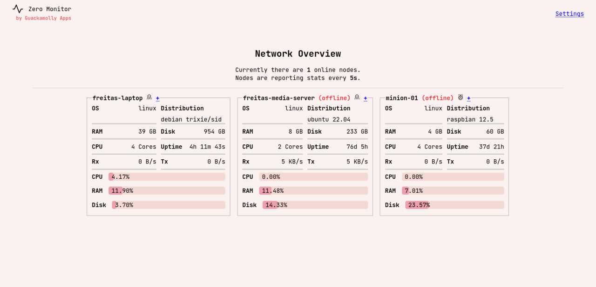

# zero-monitor

One-click lightweight server monitor tool based on ZeroMQ protocol.

---

Do you self-host software across diferent machines? Do you want to elevate your devices recoinnassance? Then zero-monitor might be the tool just for you.
Think of a mini zabbix/prometheus, but is plug-n-play (download and run a native binary), takes no more than **15MB** of RAM and doesn't overtake the CPU from other, more important, programs.

Zero-monitor is your go-to tool to quickly get insights of your server usage and information.



## How does it work?

In the zero-monitor world, there are two kind of system entities: **master** and **node**. Node is one of the server/device you want to monitor (think of monitoring agent), which reports directly and only to master. Master orchestrates nodes by sending them actions, which they will have to complete, and later report their result. One or more nodes compose a **network** that is managed by master.


---

The **zero** part of zero-monitor comes from the wire protocol used for exchanging messages in the network: [ZeroMQ](https://zeromq.org/). In particular, the tool uses [go-zeromq/zmq4](https://github.com/go-zeromq/zmq4) which is a pure go implementation of ZeroMQ, satisfying portability to the maximum.

## What data is harvested?

Expect the following data to be harvested:

- Product vendor and model (e.g., Dell XPS 13)
- OS hostname, distribution and kernel (e.g., Debian 13 5.15.0-119-generic)
- CPU load, model, architecture, available cores and threads (e.g., Intel(R) Core(TM) i7-3537U CPU @ 2.00GHz, x86_64, 2 cores, 4 KB cache)
- RAM load and capacity (e.g., 8GB)
- Disks capacity, load, name and model (e.g., SSD SCSI - Samsung_SSD_870 ( 233 GB) )
- GPUs model and vendor (e.g., NVIDIA Corporation - GK208M [GeForce GT 720M])
- Network current and total Rx/Tx (e.g, 200 MB Rx, 10 MB Tx))
- Uptime (e.g, 10 days, 4 hours)

A more updated source can be found on the models definition: [info.go](internal/data/models/info.go)

## Features

Besides monitoring, you can also take advantage of these built-in features:

- List currently open TCP and UDP connections
- List installed system packages
- List and manage system processes (aka task manager)
- Measure Internet connection speed by taking speedtests

---

## Getting Started

The simplest way to get started is by using the one-click deploy scripts provided by the tool:

```bash
wget -qO- https://raw.githubusercontent.com/guackamolly/zero-monitor/refs/heads/master/.github/get-master | bash
```

Running this command will download `master` + `init` binaries specifically for your OS + Architecture, generate a ready to use `.env` file and finally deploy `master`.

```bash
wget -qO- https://raw.githubusercontent.com/guackamolly/zero-monitor/refs/heads/master/.github/get-node | bash
```

Running this command will download `node` + `init` binaries specifically for your OS + Architecture, generate a ready to use `.env` file and finally deploy `node`.

---

Alternatively, you can download any of the master/node pre-compiled binaries from the [releases](https://github.com/guackamolly/zero-monitor/releases) page or build them from source (see [build](tools/build)).

Please refer to [env.md](docs/env.md) to get guidance on how to properly configure master/node usage.

## Tech Stack

- Go (echo v4, html/template)
- ZeroMQ (data exchange protocol)
- BoltDB (in-memory database)
- HTML + CSS (occasionally some JavaScript for setting up websocket connections and adding chart interactivity)